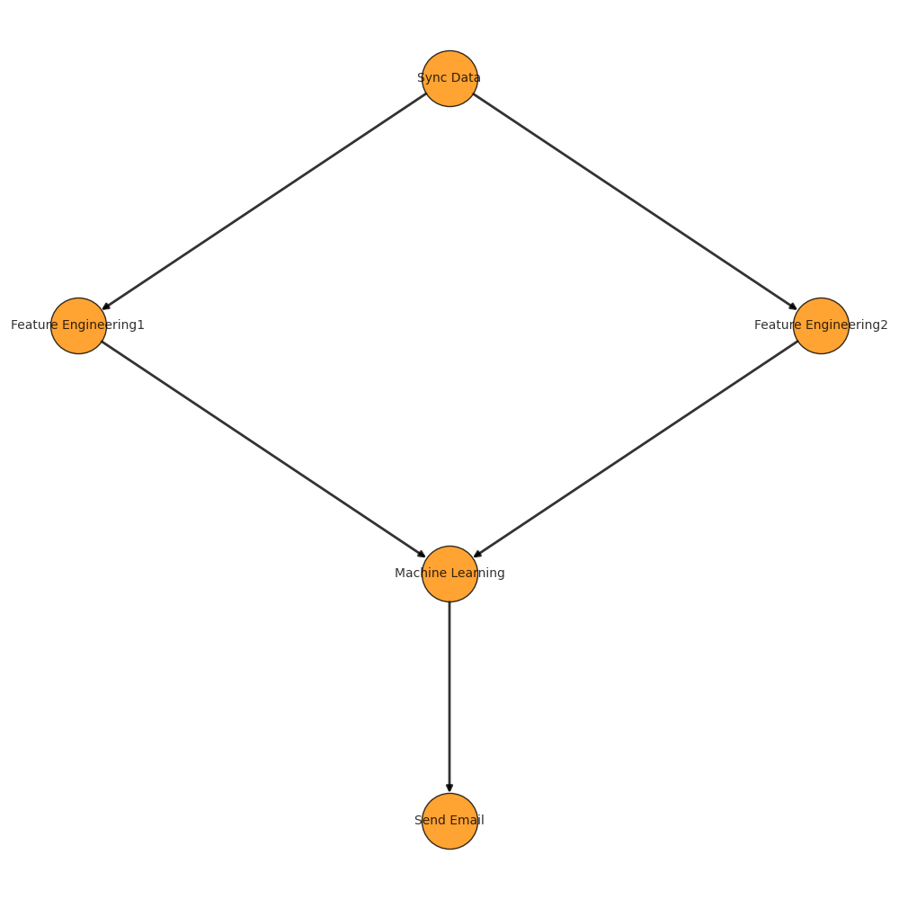
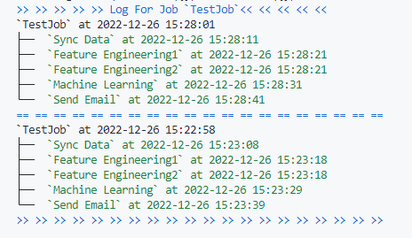
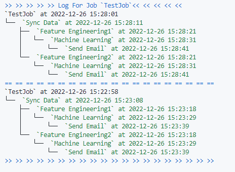

# Pydag

## What is pydag
Before explainning what is `pydag`, let't me explain you what does a  `dag` means;`dag` stands for a  `Directed Acyclic Graph`, does that ring a bell with you?Yes, the same `DAG` in `Airflow DAG`, but they are different. 
pydag is way more slim, I mean lightweight comparing to `ariflow`, yet it can also build and manage complicated workflow or pipeline.   
Pydag can not only handle sequential worflow(one task after another), but  can also handle a workflow(or a job, I will use both words interchangeably) like this:




> The task `Feature Engineering1` and `Feature Engineering2`  have to run 
> in parallel when `Sync Data` is done,  and Task `Machine Learning` has to wait until both of `Feature Engineering1` and `Feature Engineering2` finishing their jobs.


Besides **running a workflow**, pydag also supoorts:
- Schedule a workflow
- Manage a worfllow, including Create or Deltete a workflow
- Log a workflow, both at job level and task level(task belongs to the workflow)

## Install pydag
You can just run the following command to install  pydag:

```shell
 pip install pydag2
```

Although I said pydag is a lightwight tool(yes it is), it still relys on some externel stuff to make everythings function well.
Now, `pydag` relys on a job scheduling system called [gocron](https://github.com/ouqiang/gocron).   
The good news is the tool is written and build with go, so it's light(Again, airflow is just too heavy), bad news is it seems not well documented, and its only documentation is written in chineses. But most of time it will not bother you, cuz pydag will connect it via its python sdk called `pygocron`(which will be install after installing the `pydag` automatically)。  
If you konw Chinese, you can go to gocron's homepage, otherwise you can go to [here](https://github.com/superjcd/pygocron) and follow the **Install the gocron** section to install gocron.

> Although pydag can run a workflow locally ignoring the system you are using, but when it comes to the scheduling part, it is better to put on a Linux machine(eventually the workflow hand over to cron table)

## How to use
### Build a workflow
Before getting started ,there're couple of enviroment varibles to be set, most of them are for connection to the `gocron`(Just replace the `***` with real ones, and for `Windows` just substitude the `export` with set too):

```shell
# connect to gocron
export GOCRON_ADDRESS=***
export GOCRON_ADMIN_USER=***
export GOCRON_ADMIN_PASSWORD=***

# connect to redis
export PYDAG_LOG_STORE_HOST=***
export PYDAG_LOG_STORE_PASSWORD=***

```


The above envroment varibles mainly did three things to get `pydag` ready：
- first three enviroment varbles are for the connection to gocron
- the following two are for redis connection(we are using password here), this is mostly for logging purpose

(see other [available enviroments](#the-envrionment-varibles) in details below)

The syntex for building a pipelien is quite easy, here is a simple example(see `example.py` under the repo):

```python
from pydag.task import GoCronTask
from pydag.job import GoCronJob
from pygocron.pygocron import PyGoCron

# step1 : define a job(workflow)
tm = PyGoCron()
job = GoCronJob(name="TestJob", task_manager=tm)


# step2: define tasks
task1 = GoCronTask(name="Sync Data", command="echo syncdata")
task2 = GoCronTask(name="Feature Engineering1", command="echo featureengineering1")
task3 = GoCronTask(name="Feature Engineering2", command="echo featureengineering1")
task4 = GoCronTask(name="Machine Learning", command="echo machinelearning")
task5 = GoCronTask(name="Send Email", command="echo sendemail")

# step 3: define relationships between tasks
task1.set_downstream(task2)
task1.set_downstream(task3)
task2.set_downstream(task4)
task3.set_downstream(task4)
task4.set_downstream(task5)

# step 4: 
job.add_task(task1, task2, task3, task4, task5)  
print(job)
job.run(mode="execute")

```
Let's break down the syntex step by step: 
- Step 1, define a job,  `GoCronJob` takes two arguments, one for job name(note job name cannot be duplicated, if you built a job with same name before, u have to use another), another for a `taskmanager`, we use `pygocron.PyGoCron` as our taskmanager
- Step2, define tasks related to the job, `GoCronTask` takes two arguments, one for task name, another for a command（shell command）
- Step3, very important part, you have to define the relationships betweeen tasks by using `setdownstream` or `setupstream` method. Note, you can never define a dependency like `task1 -> task2 -> task1`, cuz this will lead to a infinite running loop,  fortunately `pydag` will detect the bad cyclic relationships  for you 
- The last step, you just add all tasks you defined to the job, then kick it off by the `run` method。Note the `print` will output a digrah(`png` format) to your current work directory

To run this workflow, say `example.py`, you can just run:

```shell
python example.py
```
Codes above will submit and run the workflow.If you want just submit the tasks without accually running  them, you can change `mode` argument to `submit` mode, like:
```python
 job.run(mode="submit")
```
> Behind the scene, pydag render all the tasks to the `gocron`, and pydag will keep tracking the running status for each tasks, when all task is done(no matter successed or not), the workflow will terminated too. 

If you run the above `example.py` the second time with `execute` mode, the terminal will throw you an error, to aviod this, just set following varible(linux):
```shell
export PYDAG_RUN_NEW=no
```
And try it again, things will work well this time, for more details about
`PYDAG_RUN_NEW`, see [The envrionment varibles](#the-envrionment-varibles) section below

## The pydag cli tool
`pydag` also offers a cli tool to manage our jobs too

### Submit
To submit a pipeline, you can use the `submit` sub command:

```shell
pydag submit example.py --cron="0 0 * * *" --name="TestJob"
```

`cron` is just a normal cron expression, and `name` is the jobname you defined in the `example.py` 

Behind the scene, this command will run you job(here `example.py`) by rendering it to the cron table.

> Note to run a pipleine, you have to first make your pipeline `executable` by setting the run mode to `execute`, otherwise the cron job will just submit all your tasks again and agian without actually running them 

### List 
The `list` command will list all the validated pipeline to the terminal:

```shell
pydag list
```
Output int erminal looks like:
```shell
TestJob4
TestJob3
TestJob2
TestJob
```
Also, if you want list tasks for one specifics pipeline, you can then run the following command:
```shell
pydag list --job_name="TestJob"
```
Output：

```shell
Sync Data
Feature Engineering1
Feature Engineering2
Machine Learning
Send Email
```

### Delete
To delete a pipeline, just by running the following command:

```shell
pydag delete TestJob
```
That's it 

### Log
pydag support both `job` level log and `task` level logging.

#### Get job(pipeline) level logs
To get recent loggings for a job, you can run:
```shell 
pydag log TestJob
```
Then the terminal will show you:



Note the color also shows the status of the task:
- `green` for success
- `red` for fail
- `blue` for runninng
- `yellow` for pendding

The above log  doesn't show the dependency between tasks well, if you want to, you can specify a `style` flag
```shell
pydag log TestJob --style=tree
```

Then the log will shown in a `tree` style:



Finally you can define how many recent logs do you want to show by add a `-n` flag(default is 3)

```shell 
pydag log TestJob --style=tree -n=5
```

#### Get task level logs
Getting task level log is similar, the only you need to do is just put a `--task_name` flag:

```shell
pydag log TestJob --task_name="Sync Data" -n=1
```
Again the `n` flag will limit the number of logs to be shown

## The envrionment varibles
In [build a workflow](#build-a-workflow) section, we define several enviroments, here are full list of enviroments varible you can set:

| Varible   |      Description      |  Default |
|----------|:-------------:|------:|
| PYDAG_LOG_PREFIX |  Prfix for the redis key for the log store | Pydag |
| PYDAG_ROUNDS_TIME |  The pydag  will check the `status` of a task after every  `PYDAG_ROUNDS_TIME`  |   10(second) |
| PYDAG_LOG_STORE_HOST| Redis host for log store |    (empty, must be set) |
|PYDAG_LOG_STORE_PASSWORD| Redis password |    (empty, must be set) |
|PYDAG_RUN_NEW| To run a new pipeline or existing one,  set to `yes` will always submit and run a new pipeline, `no` will run an existing one |    yes |
|PYDAG_TASK_TIMEOUT|Nobody want their tasks run forever, fortunately you can set this varible to terminate the task after the given timeout , unit is second| 3600|

## Case study

### Run a remote task
The previous example, we render our tasks to the default node(the server you deploy your gocron master node at), but some sophisticated case require a remote task run, which task will be rendered to and ran at that remote server.  
To Achieve that, you have to first deploy a `gocron-node` at that remote server(same process as you deploy `gocron`, but this time you don't need the `gocron` file, just use `gocron-node-*` and deploy it, check [here](https://github.com/superjcd/pygocron#Prerequisite) if u forgot), and make sure you exposed(open) the node port too(default is `5921`).  
Then you have to let  `gocron` know you added that node, you can either go to the `gocron` admin page or use `pygocron` to do it for you:
```pyhton
pgc = PyGoCron()

pgc.add_new_node(ip="your node ip", port="your node port", alias="name for the node", remark="some comment")
```

If no errors occurs, your can then run `pgc.get_nodes()` to check if that node is added or not, then you can run the following command to check your node is accessable or not:

```python
pgc = PyGoCron()

pgc.check_node(node_id=2)   # you can get this by the get_nodes method 
```
If things went well, we could specify a `node_id` when define a task:

```python
task1 = GoCronTask(name="Sync Data", command="echo syncdata", node_id=2)
```
Then the task `Sync Data` with `echo syncdata` command will run at remote node with a node id `2`  

Good luck, have fun.
